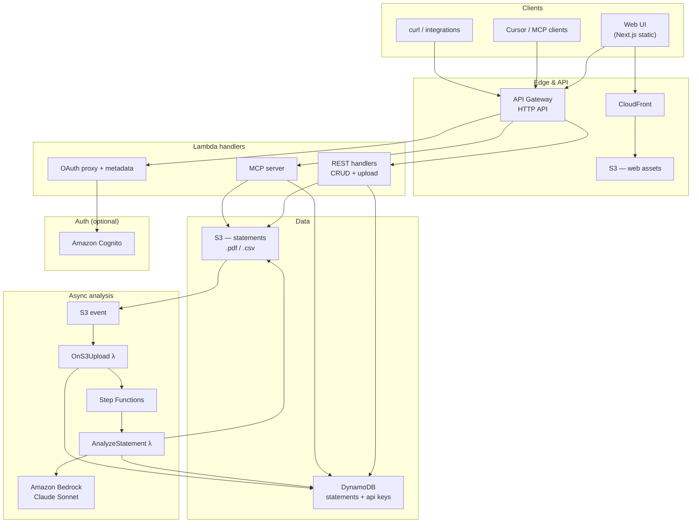

# Finlens

Finlens is a remote MCP product for bank statement analysis on AWS. Upload a monthly bank **PDF or CSV** (Hebrew or English), run async Bedrock analysis, and get structured financial summaries plus narrative spending insights — via **REST**, **remote MCP**, or the **web dashboard**.

## Live (dev)

| Surface | URL |
|---------|-----|
| Web UI | https://d1l5l6otiduz0x.cloudfront.net |
| REST / MCP API | https://xaq0zzwnv7.execute-api.eu-west-1.amazonaws.com |
| MCP endpoint | https://xaq0zzwnv7.execute-api.eu-west-1.amazonaws.com/mcp |

Auth uses header `X-Api-Key`. Keys are stored as SHA-256 hashes in the ApiKeysTable, mapped to a `tenantId` — mint one with `node scripts/create-api-key.mjs --table <ApiKeysTableName> --tenant <tenantId>`. In dev, the shared `finlens-dev-local-key` shortcut (stack output `DevApiKey`, tenant `dev`) also works. Cognito OAuth is wired for MCP but API key is the reliable path in Cursor today.

## Features

- Upload bank statements as **PDF** or **CSV**
- Async pipeline: S3 → Step Functions → Lambda → **Amazon Bedrock** (Claude)
- REST API for create, list, get, upload, and **delete**
- Remote **MCP** (Streamable HTTP) with four tools
- Next.js dashboard (SnowUI-inspired layout)
- Multi-tenant metadata in DynamoDB (`tenantId` from API key or Cognito JWT)

## Architecture



### AWS services

<p align="center">
  
  &nbsp;
  
  &nbsp;
  
  &nbsp;
  
  &nbsp;
  
  &nbsp;
  
  &nbsp;
  
  &nbsp;
  
</p>

Icons from [awslabs/aws-icons-for-plantuml](https://github.com/awslabs/aws-icons-for-plantuml) (Apache-2.0).

| Service | Role in Finlens |
|---------|-----------------|
| **Amazon CloudFront** | CDN for the static Next.js dashboard |
| **Amazon S3** | Private buckets for statement files (`.pdf`, `.csv`) and exported web assets |
| **Amazon API Gateway (HTTP API)** | Single HTTPS entry for REST, MCP, and OAuth routes |
| **AWS Lambda** | REST handlers, MCP server, OAuth bridge, S3 trigger, Bedrock analysis |
| **Amazon DynamoDB** | Statement records (status, summaries, insights) and API key hashes |
| **AWS Step Functions** | Wraps the analyze Lambda: retries transient Bedrock/Lambda errors with exponential backoff, and on unrecoverable failure marks the statement row `failed` in DynamoDB |
| **Amazon Bedrock** | Claude model for PDF document + CSV text analysis |
| **Amazon Cognito** | User pool + Google IdP for MCP OAuth (alongside dev API key) |

**Region:** `eu-west-1` · **IaC:** AWS CDK (TypeScript) · **Account:** see `infra/cdk.json`

### Upload → analysis flow

1. Client uploads via `POST /v1/statements/upload` (base64) or presigned `POST /v1/statements`.
2. File lands in S3 under `statements/{tenantId}/{statementId}.{pdf|csv}`.
3. S3 `OBJECT_CREATED` invokes **OnS3Upload** Lambda → marks row `processing` → starts Step Functions.
4. **AnalyzeStatement** Lambda reads the file, calls Bedrock, writes `financialSummary` + `spendingInsights`, sets status `ready` (or `failed`). Step Functions retries transient errors (Bedrock throttling/timeouts, Lambda service errors) up to 3 times with exponential backoff; if the task still fails — including crashes or timeouts the Lambda can't catch itself — a catch step writes status `failed` + `errorMessage` to the row before the execution fails.
5. Client polls `GET /v1/statements/{id}?detail=summary` or uses MCP `get_statement`.

## Monorepo layout

```
apps/
  api/           Lambda handlers (REST, MCP, OAuth, pipeline)
  web/           Next.js static dashboard (CloudFront)
packages/
  domain/        Shared TypeScript types
  mcp/           MCP tool names + agent instructions
infra/           AWS CDK stack (`FinlensDevStack` / `FinlensProdStack`)
```

## REST API (v1)

All routes require `X-Api-Key` in dev (or `Authorization: Bearer` Cognito JWT on MCP).

| Method | Path | Description |
|--------|------|-------------|
| `POST` | `/v1/statements` | Create statement + presigned upload URL |
| `POST` | `/v1/statements/upload` | Direct upload (JSON `{ base64, filename }`) |
| `GET` | `/v1/statements` | List recent statements |
| `GET` | `/v1/statements/{id}?detail=summary\|full` | Get status / analysis |
| `DELETE` | `/v1/statements/{id}` | Delete statement + S3 object |

### Example

```bash
export API_URL=https://xaq0zzwnv7.execute-api.eu-west-1.amazonaws.com
export API_KEY=finlens-dev-local-key

# List
curl -s "$API_URL/v1/statements" -H "X-Api-Key: $API_KEY" | jq

# Upload PDF or CSV (base64)
curl -s -X POST "$API_URL/v1/statements/upload" \
  -H "Content-Type: application/json" \
  -H "X-Api-Key: $API_KEY" \
  -d '{"base64":"...","filename":"statement.csv"}' | jq

# Poll summary
curl -s "$API_URL/v1/statements/$STATEMENT_ID?detail=summary" \
  -H "X-Api-Key: $API_KEY" | jq

# Delete
curl -s -X DELETE "$API_URL/v1/statements/$STATEMENT_ID" \
  -H "X-Api-Key: $API_KEY" | jq
```

## MCP tools

| Tool | Description |
|------|-------------|
| `upload_statement` | Upload PDF/CSV as base64 + filename |
| `get_statement` | Poll status and summary (`detail=summary\|full`) |
| `list_statements` | List up to 20 recent uploads |
| `delete_statement` | Permanently delete a statement |

### Cursor config (dev)

```json
{
  "mcpServers": {
    "finlens": {
      "url": "https://xaq0zzwnv7.execute-api.eu-west-1.amazonaws.com/mcp",
      "headers": {
        "X-Api-Key": "finlens-dev-local-key"
      }
    }
  }
}
```

## Design references

- [SnowUI Design System](https://www.figma.com/design/PIcIocu0vcBS8biHwWyc2b/SnowUI-Design-System--Community-?node-id=60755-3905)
- [Dashboard layout reference](https://www.figma.com/design/ik7CMptQeecUUQZxc0EEhh/Dashboard-Design-System--Community-?node-id=913-3655)

## Development

**Requirements:** Node.js ≥ 20, AWS CLI, CDK bootstrap in `eu-west-1`.

```bash
git clone https://github.com/Jordan1881/Finlens.git
cd Finlens
npm install

# Build web + deploy dev stack (from infra/)
cd infra
npm run deploy:dev
# or: npx cdk deploy FinlensDevStack --profile finlens
```

Optional CDK context for ops email alerts (issue #19):

```bash
# Confirm the SNS subscription email after first deploy
npx cdk deploy FinlensDevStack -c opsAlertEmail=ops@example.com --profile finlens
```

If `opsAlertEmail` is omitted, the ops SNS topic and alarm actions are still created; add a subscription later and confirm it in email.

Web build env (injected by `deploy:dev`):

```bash
NEXT_PUBLIC_FINLENS_API_URL=https://<api-id>.execute-api.eu-west-1.amazonaws.com
NEXT_PUBLIC_FINLENS_API_KEY=finlens-dev-local-key
```

Copy `apps/web/.env.production.example` for local static builds.

### Useful scripts

| Command | Description |
|---------|-------------|
| `npm run build` | Build all workspaces |
| `npm run cdk:synth` | Synthesize CloudFormation |
| `npm run cdk:deploy:dev` | Build web + deploy `FinlensDevStack` |

Stack outputs include `ApiUrl`, `WebUrl`, `McpUrl`, `StatementsBucketName`, `StatementsTableName`, and `DevApiKey`.

## License

Private / all rights reserved unless otherwise noted in the repository.
